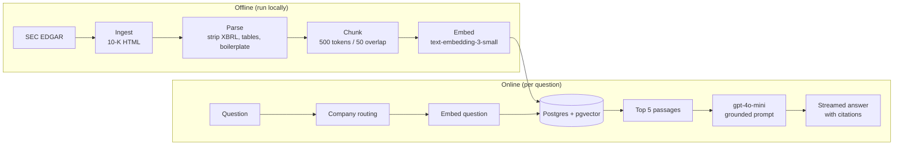
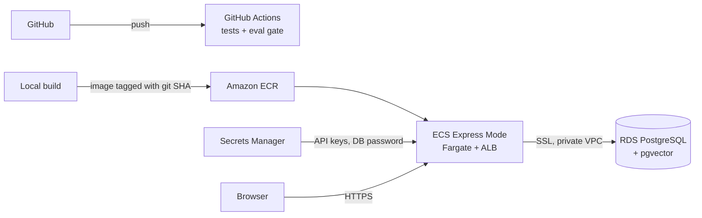

# Earnings RAG

[](https://github.com/dennisdang5/earnings-rag/actions/workflows/ci.yml)

Ask questions about NVIDIA, Apple, and Capital One annual reports and get answers drawn only from the filings, with every claim linked to the passage it came from.

**Live demo:** [ea-f1d2aa79276a44b6bd633fd808d49629.ecs.us-east-1.on.aws](https://ea-f1d2aa79276a44b6bd633fd808d49629.ecs.us-east-1.on.aws/)

This is an end-to-end retrieval-augmented generation system: SEC ingestion, parsing, chunking, embedding, vector search, grounded generation, a streaming web UI, an evaluation harness that gates CI, and a deployment on AWS.

---

## Tech stack

| Layer | Tools |
|---|---|
| Language | Python 3.11 |
| Ingestion | SEC EDGAR APIs |
| Parsing | BeautifulSoup, lxml |
| Embeddings | OpenAI `text-embedding-3-small` |
| Vector store | PostgreSQL + pgvector |
| Generation | OpenAI `gpt-4o-mini` |
| API | FastAPI, Pydantic |
| Frontend | HTML, JavaScript |
| Observability | Prometheus, structlog |
| Containers | Docker, Docker Compose |
| CI | GitHub Actions |
| Cloud | AWS ECR, ECS, RDS, Secrets Manager |

---

## Architecture



**Offline**, filings are downloaded once, cleaned, split into overlapping token windows, embedded, and stored.

**Per question**, the question is embedded, the five nearest passages are retrieved by cosine distance, and the model answers using only those passages, citing each claim as `[n]`. If nothing retrieved discusses the subject, it says so instead of answering.

### Corpus

Four recent 10-Ks per company, 1,799 chunks total:

| Company | Fiscal years | Chunks |
|---|---|---|
| NVIDIA | 2023–2026 | 480 |
| Apple | 2022–2025 | 276 |
| Capital One | 2022–2025 | 1,043 |

### Pipeline details

- **Ingestion** resolves tickers to SEC CIKs, walks each company's filing history, and downloads the primary 10-K document. Downloads are cached, so re-running fetches nothing new.
- **Parsing** removes the hidden inline-XBRL header, unwraps inline tags so words split across `<span>` boundaries rejoin, drops tables, filters page furniture (headers, page numbers), and trims the cover page and checkbox boilerplate before Item 1.
- **Search is exact, not approximate.** At 1,799 rows a brute-force scan takes milliseconds.
- **Company routing** — if a question names exactly one company, retrieval is limited to that company's chunks. Comparison questions naming several companies search everything.

---

## The web interface

- **Streaming answers** over Server-Sent Events, with staged progress: searching, reading passages, writing
- **Citations are interactive** — hover `[2]` for a preview of the passage, click it to open the sources and highlight passage 2
- **Match strength** shown as a bar and a plain label ("Close match") rather than a raw cosine distance
- **Refusals are styled as deliberate answers**, not errors
- Model output and filing text are never inserted with `innerHTML`; everything is built as DOM text nodes

---

## Evaluation

The harness lives in `eval/` and measures the two stages.

### Retrieval: recall@5

**0.864 (19/22)** on 22 hand-written questions, balanced across the three companies.

Every expected passage was read and verified by hand. Questions were written from sampled chunks, then searched for sibling passages in other filing years *before* scoring, so the answer key wasn't adjusted after seeing results.

Ground truth is stored as **anchor phrases** — short verbatim sentences from the answering passage — rather than chunk IDs. Chunk IDs are positional, so any change to chunking renumbers everything; anchors survive re-chunking, which made the chunk-size sweep possible. Anchor matching was validated against ID matching on the same corpus before being trusted.

### Generation: refusal precision

A retrieval metric can't see a model that receives the right passage and refuses anyway. So a second check calls the full pipeline and sorts results into three lists:

| Outcome | Meaning | Current |
|---|---|---|
| False refusal | Right passage retrieved, model refused | 0 |
| Missed refusal | Question outside the corpus, model answered | 0 |
| Retrieval refusal | Wrong passages retrieved, model correctly refused | 1 |

Only the first two are generation failures. The third is a retrieval miss handled honestly downstream.

### CI gate

Every push runs the tests and the retrieval eval in GitHub Actions. The build fails if recall drops below 0.75.

CI is **hermetic**: no API keys, no network calls. It loads a committed 200-chunk fixture corpus with precomputed embeddings — every ground-truth passage plus the specific passages that compete with them in known misses — and precomputed question embeddings. The fixture reproduces the full corpus's recall exactly.

```bash
python eval/run_eval.py --match anchor                 # retrieval, full corpus
python eval/run_eval.py --match anchor --offline       # retrieval, as CI runs it
python eval/run_eval.py --refusals                     # generation (uses the API)
```

---

## What the measurements showed

Detailed write-ups are in [`DECISIONS.md`](DECISIONS.md). The ones that shaped the system most:

**500-token chunks are a measured optimum, not a default.**

| Chunk size | Chunks | recall@5 |
|---|---|---|
| 250 | 4,035 | 0.737 |
| **500** | **1,799** | **0.842** |
| 750 | ~1,200 | 0.789 |

Smaller chunks lost context and multiplied near-identical candidates; larger ones mixed unrelated topics into one vector.

**A prompt fix measured in both directions.** "What limits NVIDIA from selling to China?" refused 8 times in 10 with the correct passages retrieved. Changing only the capitalization of the question flipped it to 0/10, with identical retrieval — generation was sitting on a decision boundary. Rewording the prompt to explicitly accept hedged, risk-framed passages brought all phrasings to 0/10 refusals, verified against the out-of-corpus questions so it didn't start answering questions it shouldn't.

**Company routing had no measurable effect.** Recall was identical with and without it, with identical retrieved passages — unfiltered search was already returning only the named company's chunks. Kept as cheap insurance for vague questions, and not claimed as an improvement.

### Known limitations

- **Three Capital One questions still miss.** Two fail because "credit" means several things in a bank filing (credit ratings, credit quality, credit losses); one fails because adjacent chunks in a fair-value note are nearly indistinguishable. Company filtering can't help either — the competition is Capital One against itself.
- **Tables are dropped**, so numeric questions are out of scope. The right design for those is text-to-SQL over the filings' XBRL data, as a separate path.
- **Company patterns are hardcoded** for three tickers. At larger scale they'd be generated from SEC company names at ingest.
- **The eval set is small.** At 22 questions each one is worth about 4.5 points of recall.

---

## Running it locally

**Prerequisites:** Python 3.11+, Docker, an OpenAI API key.

```bash
git clone https://github.com/dennisdang5/earnings-rag.git
cd earnings-rag

cp .env.example .env          # then add your OpenAI key and SEC user agent

python -m venv .venv
source .venv/bin/activate     # Windows: .venv\Scripts\Activate.ps1
pip install -r requirements.txt
pip install -e .

docker compose up -d db       # Postgres + pgvector on localhost:5433
```

Build the corpus (downloads 12 filings, embeds ~1,800 chunks for a few cents):

```bash
python -c "from earnings_rag.ingest import ingest_all; ingest_all()"
python -c "from earnings_rag.chunking import chunk_all; chunk_all()"
python earnings_rag/pipeline.py
```

Run the app:

```bash
uvicorn earnings_rag.api:app --reload
```

Then open `http://localhost:8000` for the UI, or `http://localhost:8000/docs` for the API.

Or run the whole thing in containers:

```bash
docker compose up --build
```

### API

| Endpoint | Purpose |
|---|---|
| `GET /` | Web interface |
| `POST /ask` | Answer plus source excerpts, as JSON |
| `POST /ask/stream` | Same, streamed as Server-Sent Events |
| `GET /chunks/{id}` | Full text of one passage |
| `GET /health` | Liveness check |
| `GET /metrics` | Prometheus metrics |

`/metrics` includes request counts, latency, and the cosine distance of the top retrieved passage.

---

## Deployment



- **Images are tagged with the git commit SHA**, so the running version maps to exactly one commit
- **Secrets come from Secrets Manager** at container start and never appear in the task definition; the execution role can read only this project's secret
- **RDS accepts connections only from the ECS service's security group**, referenced by group rather than IP since Fargate addresses change
- **SSL is set per environment** — disabled locally and in CI, required on RDS
- **A CloudWatch alarm rolls back deployments** when the error rate rises

---

## Repository layout

```
earnings_rag/
  config.py        settings from environment variables
  ingest.py        EDGAR download and caching
  chunking.py      HTML cleaning and token chunking
  embeddings.py    OpenAI embedding calls
  store.py         Postgres schema, inserts, vector search
  llm.py           grounding prompt, generation, streaming
  pipeline.py      routing, retrieval, ask()
  api.py           FastAPI endpoints, metrics, logging
  static/
    index.html     web interface
eval/
  questions.yaml         hand-written questions and anchor phrases
  run_eval.py            recall@k and refusal checks
  build_fixture.py       builds the CI fixture from the full corpus
  load_fixture.py        loads it into a *_ci database
  fixture_chunks.jsonl   200 chunks with embeddings
  fixture_queries.json   precomputed question embeddings
tests/
.github/workflows/ci.yml
Dockerfile
docker-compose.yml
DECISIONS.md               every design decision and finding, with reasoning
```

---

By Dennis Dang